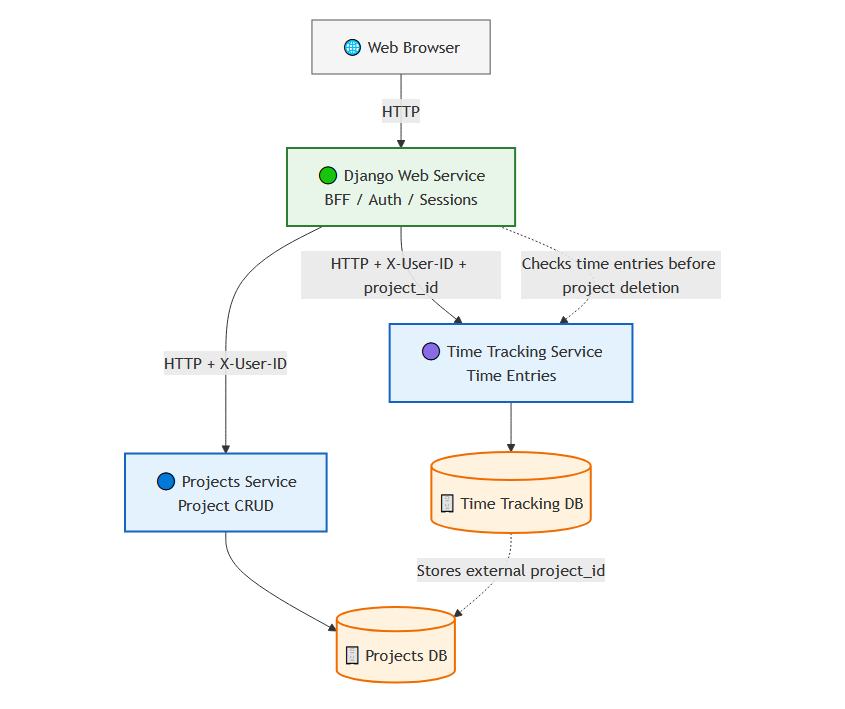

# Productivity Microservices Platform

A multi-service backend platform designed to demonstrate modern backend architecture using Django, Flask, Docker, and service-oriented application design.

The application allows users to:

- Create and manage projects
- Track work sessions against projects
- Manage productivity workflows through a Django Backend-for-Frontend (BFF)
- Interact with independent Flask microservices through a unified web interface

The platform is designed as a backend engineering portfolio project focused on service-oriented architecture, Docker-based workflows, API design, and multi-service orchestration.

---

## 🎯 Project Goal

This backend engineering portfolio project was built to demonstrate:

- Microservice architecture design
- Django + Flask interoperability
- REST API development
- Docker-based development workflows
- Service orchestration and isolation
- Database migration management across services
- Automated testing and code quality practices
- Production-style deployment patterns

---

## 🛠️ Tech Stack

- **Backend:** Python, Django, Flask
- **Databases:** PostgreSQL
- **Architecture:** Microservices, REST APIs, Backend-for-Frontend, Service-Oriented Design
- **Infrastructure:** Docker, Docker Compose, AWS EC2
- **API Documentation:** OpenAPI / Swagger via flask-smorest
- **Testing & Quality:** Pytest, Django Test Framework, flake8

---

## 🔑 Key Features

- Django web service
- Flask projects service
- Flask time-tracking service
- Dedicated per-service API documentation
- Dockerised development environment
- Independent service migrations
- Local admin access
- Test and linting workflow across services

---

## 🧱 Engineering Practices

- Automated testing covering API and model behaviour
- Dockerised development environment
- Environment-based configuration management
- Code quality enforcement using flake8
- Modular service-oriented application structure
- Test-Driven Development (TDD) applied to core features

### Development Workflow

- Feature branches used for isolated TDD workflows
    - [Example TDD commit history](https://github.com/xMattC/productivity-microservices-platform/commits/time-tracking-bff-client-TDD/)
- Pull request workflow for review and integration
    - [Closed PRs](https://github.com/xMattC/productivity-microservices-platform/pulls?q=is%3Apr+is%3Aclosed)
- Documented testing strategy and system guarantees
    - [Testing guarantees document](https://github.com/xMattC/productivity-microservices-platform/blob/refactor/docs/testing_and_system_guarantees.md)
- GitHub Actions for continuous integration (testing + linting)
    - [Action History](https://github.com/xMattC/productivity-microservices-platform/actions)
- Kanban-based project management
    - [Project board: Planning](https://github.com/users/xMattC/projects/4/views/1)
    - [Project board: Tasks](https://github.com/users/xMattC/projects/4/views/7)
- Docker-based deployment to AWS
    - [Deployment strategy document - TODO]
---

## 🖼️ Application Screenshots

### Django Web Service

The Django web application acts as the primary Backend-for-Frontend (BFF) layer for the platform.

Features demonstrated include:

- User authentication and session management
- Project management workflows
- Integration with downstream Flask services
- User-scoped application behaviour

> Django web interface screenshot placeholder

---

### Projects Service API Documentation


---

### Time Tracking Service API Documentation


---

## 📈 Service Architecture

A key focus of this project was designing clear boundaries between services while maintaining a simple local development workflow.

The system is split into independent backend services:



This architecture allows:

- Separation of business domains across services
- Independent database migrations per service
- Isolated API logic and responsibilities
- Easier scalability and maintainability
- Containerised local development with Docker Compose

The Django service acts as the primary web/BFF layer, while Flask services handle domain-specific functionality such as project management and time tracking.

[See the full architecture document](/docs/architecture.md)

---

## 📚 Service API Documentation

Each backend service includes its own dedicated API documentation.

| Service | API Documentation |
|---|---|
| Projects Service | [View API Docs](services/projects/docs/API.md) |
| Time Tracking Service | [View API Docs](services/time-tracking/docs/API.md) |

These documents include:

- Endpoint definitions
- Request/response examples
- Validation behaviour
- Error responses
- Service-specific API workflows

---

## 🔐 Authentication & Permissions

Authentication is handled by the Django web service using Django’s built-in authentication and session-based login flow.

Downstream Flask services receive the authenticated user context from the Django BFF via the `X-User-ID` request header.

Permissions and ownership are enforced through:

- Protected Django views for authenticated users
- User-scoped service requests from the Django BFF
- `X-User-ID` ownership checks in Flask services
- Database queries filtered by the authenticated user ID
- Service-level boundaries between web, projects, and time-tracking data

This ensures users only access project and time-tracking data associated with their own account while keeping service responsibilities separated.

---

## ⚠️ Validation & Error Handling

This includes:

- Request validation using Marshmallow schemas in Flask services
- Consistent service response structures using `results`
- Ownership checks using the authenticated user context
- User-scoped access validation through `X-User-ID`
- Service-client error handling in the Django BFF

Common responses include:

- `400 Bad Request` → Missing required request data or user context
- `404 Not Found` → Requested resource does not exist or does not belong to the user
- `5xx Service Error` → Downstream service unavailable or unexpected response

---

## ⚙️ Known Limitations

- Service-to-service communication is simplified for development and portfolio demonstration purposes
- Authentication and authorisation flows are intentionally lightweight
- Infrastructure focuses on Docker-based deployment rather than full production orchestration
- Advanced observability tooling (distributed tracing, metrics aggregation, alerting) is not implemented
- No horizontal scaling or container orchestration layer (e.g. Kubernetes)
- CI/CD pipelines focus on automated testing and linting rather than full deployment automation
- APIs are internally structured but not versioned for public consumption
- Demo deployment may be reset or updated without notice

---

## 📦 Running Locally

### Prerequisites

Before running this project, ensure you have:

- Git (to clone the repository)
- Docker & Docker Compose (to run the application)

> If you're using Windows or macOS, install Docker Desktop which includes Docker Compose.

### 1. Clone Repository

```bash
git clone https://github.com/xMattC/..........
cd .............
```

### 2. Run migrations for all services:


```bash
docker compose up --build -d && \
docker compose run --rm web python manage.py migrate && \
docker compose run --rm projects flask --app app.main:create_app db init && \
docker compose run --rm projects flask --app app.main:create_app db migrate -m "Initial migration" && \
docker compose run --rm projects flask --app app.main:create_app db upgrade && \
docker compose run --rm time-tracking flask --app app.main:create_app db init && \
docker compose run --rm time-tracking flask --app app.main:create_app db migrate -m "Initial migration" && \
docker compose run --rm time-tracking flask --app app.main:create_app db upgrade
```

### 3. Seed Data

```bash
TODO
```

### 4. Create Superuser

Run the following command to create a superuser (non-interactive):

```bash
docker compose run --rm \
  -e DJANGO_SUPERUSER_EMAIL=admin@example.com \
  -e DJANGO_SUPERUSER_PASSWORD=change-me \
  web python manage.py createsuperuser --noinput
```

Example local admin:
> Email: admin@example.com<br>
> Password: change-me<br>
> (Local development only)

### 5. Start Server

```bash
docker-compose up
```
---
### User Login

**web home:**
http://localhost:8000

### Accessing Admin

**Admin URL:**
http://localhost:8000/admin/

Login using the local admin credentials above.


---
### Run all Tests & Linting


```bash
clear && \
echo "Running all tests and linting across services..." && \
docker compose run --rm web python manage.py test ; \
docker compose run --rm projects pytest ; \
docker compose run --rm time-tracking pytest ; \
docker compose run --rm web flake8 ; \
docker compose run --rm projects flake8 ; \
docker compose run --rm time-tracking flake8
```

