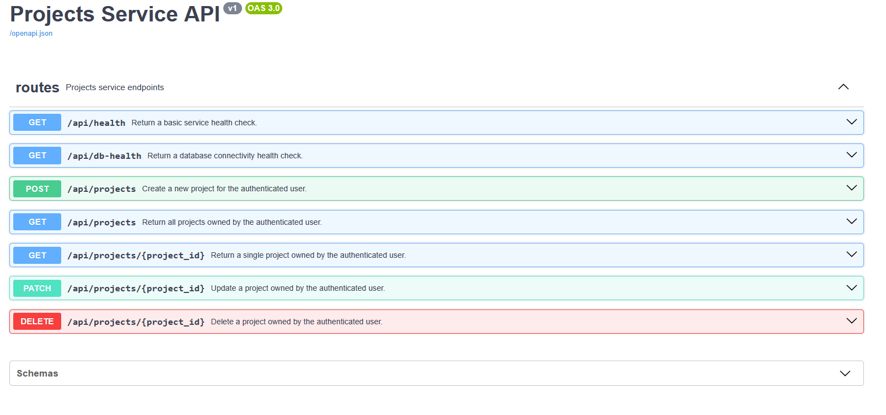
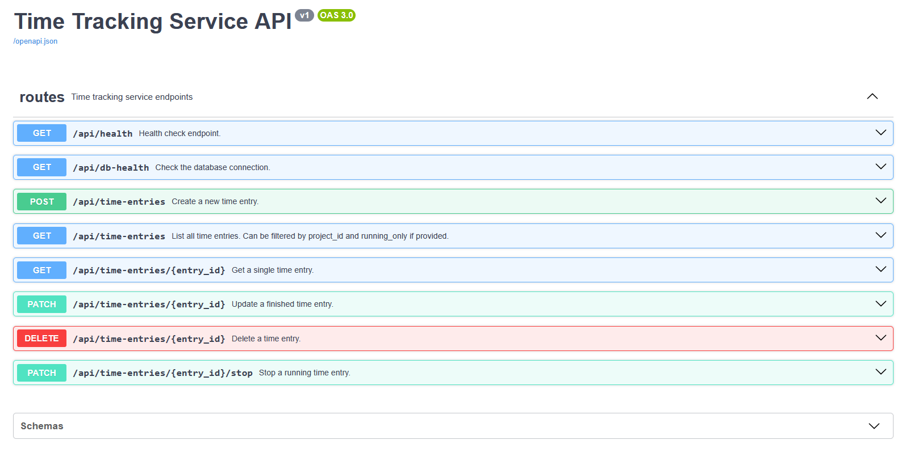

# Productivity Microservices Platform


A multi-service backend platform designed to demonstrate modern backend engineering using Django, Flask, Docker, and service-oriented architecture.

The platform enables users to manage projects, track work sessions, and interact with multiple backend services through a unified Django web interface.


This project focuses on scalable backend architecture, API-driven service communication, containerised development workflows, and production-style deployment practices.

**Live Demo:** https://productivity-app.xmattc.com/

You can create an account or use the demo login:

> Email: demo@example.com<br>
> Password: demo12345<br>

---

## 🎯 Engineering Focus

This project was built to demonstrate:

- Microservice architecture and service isolation
- Django + Flask interoperability
- REST API design and inter-service communication
- Docker-based local development workflows
- AWS EC2 deployment with automated CI/CD pipelines
- Database migration management across services
- Automated testing and code quality pipelines
- Production-oriented deployment and release automation
- Continuous Integration and Continuous Deployment (CI/CD)

---

## 🛠️ Tech Stack

- **Backend:** Python, Django, Flask
- **Databases:** PostgreSQL
- **Architecture:** Microservices, REST APIs, Backend-for-Frontend, Service-Oriented Design
- **Infrastructure:** Docker, Docker Compose, AWS EC2
- **API Documentation:** OpenAPI / Swagger via flask-smorest
- **Testing & Quality:** Pytest, Django Test Framework, flake8

---

## 🔑 Key Features

- Django Backend-for-Frontend (BFF) web service
- Independent Flask microservices
- Project management API
- Time-tracking API
- PostgreSQL-backed services
- Per-service OpenAPI / Swagger documentation
- Docker Compose development environment
- Independent service migrations
- Local admin tooling
- Automated testing and linting workflows

---

## 🧱 Engineering Practices

- Automated testing covering API and model behaviour
- Dockerised development environment
- Environment-based configuration management
- Code quality enforcement using flake8
- Modular service-oriented application structure
- Test-Driven Development (TDD) applied to core features

### Development Workflow

- Test-Driven Development (TDD) workflows using feature branches
    - [Example incremental TDD commit history](https://github.com/xMattC/productivity-microservices-platform/commits/time-tracking-bff-client-TDD/)
- Pull request workflow for review and integration
    - [Closed PRs](https://github.com/xMattC/productivity-microservices-platform/pulls?q=is%3Apr+is%3Aclosed)
- Documented testing strategy and system guarantees
    - [Testing guarantees document](docs/testing_and_system_guarantees.md)
- GitHub Actions CI/CD pipelines
    - Automated testing and linting on pull requests
    - Protected `main` branch with required status checks
    - Automated AWS EC2 deployment on merge to `main`
    - [Action History](https://github.com/xMattC/productivity-microservices-platform/actions)

- Kanban-based project management
    - [Project board: Planning](https://github.com/users/xMattC/projects/4/views/1)
    - [Project board: Tasks](https://github.com/users/xMattC/projects/4/views/7)

---
## 📈 Service Architecture

A core focus of this project was designing clear service boundaries while maintaining a simple local development workflow. The platform is structured as independent backend services:

<p align="center">
  
</p>

This architecture provides:

- Separation of business domains
- Independent database ownership and migrations
- Isolated API logic and responsibilities
- Improved maintainability and scalability
- Containerised local development using Docker Compose

The Django application acts as the primary Backend-for-Frontend (BFF) layer, while Flask services handle domain-specific functionality such as project management and time tracking.

[See the full architecture document](docs/architecture.md)

---

## 🖼️ Application Screenshots

### Django Web Service

The Django web application acts as the primary Backend-for-Frontend (BFF) layer for the platform.

Features demonstrated include:

- User authentication and session management
- Project management workflows
- Integration with downstream Flask services
- User-scoped application behaviour

> Django web interface screenshot placeholder

---


## 📚 Service API Documentation

Each backend service includes dedicated API documentation.

| Service               | Documentation                                           |
| --------------------- | ------------------------------------------------------- |
| Projects Service      | [API Documentation](services/projects/docs/API.md)      |
| Time Tracking Service | [API Documentation](services/time-tracking/docs/API.md) |

The APIs are also documented using live OpenAPI / Swagger interfaces via `flask-smorest`.

### Projects Service Swagger



### Time Tracking Service Swagger



---

## 🔐 Authentication & Permissions

Authentication is handled by the Django web service using Django’s built-in authentication and session-based login flow.

Downstream Flask services receive the authenticated user context from the Django BFF via the `X-User-ID` request header.

Permissions and ownership are enforced through:

- Protected Django views for authenticated users
- User-scoped service requests from the Django BFF
- `X-User-ID` ownership checks in Flask services
- Database queries filtered by the authenticated user ID
- Service-level boundaries between web, projects, and time-tracking data

This ensures users only access project and time-tracking data associated with their own account while keeping service responsibilities separated.

---

## ⚠️ Validation & Error Handling

This includes:

- Request validation using Marshmallow schemas in Flask services
- Consistent service response structures using `results`
- Ownership checks using the authenticated user context
- User-scoped access validation through `X-User-ID`
- Service-client error handling in the Django BFF

Common responses include:

- `400 Bad Request` → Missing required request data or user context
- `404 Not Found` → Requested resource does not exist or does not belong to the user
- `5xx Service Error` → Downstream service unavailable or unexpected response

---

## ⚙️ Known Limitations

- Service-to-service communication is simplified for development and portfolio demonstration purposes
- Authentication and authorisation flows are intentionally lightweight
- Infrastructure focuses on Docker-based deployment rather than full production orchestration
- Advanced observability tooling (distributed tracing, metrics aggregation, alerting) is not implemented
- No horizontal scaling or container orchestration layer (e.g. Kubernetes)
- CI/CD pipelines currently target a single EC2 deployment environment
- APIs are internally structured but not versioned for public consumption
- Demo deployment may be reset or updated without notice

---

## 📦 Running Locally

### Prerequisites

Before running this project, ensure you have:

- Git (to clone the repository)
- Docker & Docker Compose (to run the application)

> If you're using Windows or macOS, install Docker Desktop which includes Docker Compose.

---

## 1. Clone Repository

```bash
git clone https://github.com/xMattC/productivity-microservices-platform.git
cd productivity-microservices-platform
```

---

## 2. Run Initial Setup


```bash
# Run database migrations for all services:
docker compose run --rm web python manage.py migrate
docker compose run --rm projects flask --app app.main:create_app db upgrade
docker compose run --rm time-tracking flask --app app.main:create_app db upgrade

# Seed demo user data:
docker compose run --rm web python manage.py seed_demo_data --reset

# Create a local admin user:
docker compose run --rm \
    -e DJANGO_SUPERUSER_EMAIL=admin@example.com \
    -e DJANGO_SUPERUSER_PASSWORD=change-me \
    web python manage.py createsuperuser --noinput
```

---

## 3. Start the Application

```bash
docker compose up
```


Web app: http://localhost:8000

> Create an account or<br>
> Email: demo@example.com<br>
> Password: demo12345<br>

Admin panel: http://localhost:8000/admin/

> Email: admin@example.com<br>
> Password: change-me<br>

---


## 4. Test Deployment Configuration Locally

Run the platform locally using the deployment Docker Compose configuration.

```bash
# Run deployment compose:
docker compose -f docker-compose.yml -f docker-compose-deploy.yml up --build -d

# View running containers:
docker compose -f docker-compose.yml -f docker-compose-deploy.yml ps

# Stop the deployment stack:
docker compose -f docker-compose.yml -f docker-compose-deploy.yml down --remove-orphans
```

---